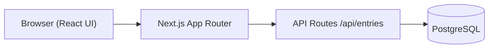

# Personal Analytics Dashboard

Track personal metrics (study hours, spending, health habits) and explore trends through a Next.js dashboard with PostgreSQL persistence.

**Live demo:** _Not deployed yet — complete [Production deploy](#production-deploy-vercel--neon) (Vercel + Neon, ~5 min), then add `https://<your-project>.vercel.app/dashboard` here._

[](https://github.com/HimendraFdo/personal-analytics-dashboard/actions/workflows/ci.yml)

---

## Preview


---

## Tech stack

| Layer | Tools |
|-------|--------|
| App | Next.js 15 (App Router), React 19, TypeScript |
| Styling | Tailwind CSS 4 |
| Data | Prisma ORM, PostgreSQL |
| Charts | Recharts |
| Validation | Zod |
| Hosting | Vercel |
| Database (production) | [Neon](https://neon.tech) serverless Postgres |

---

## Architecture



Routes: `/dashboard`, `/entries`, `/analytics`. Data flows through REST handlers (`GET`, `POST`, `PATCH`, `DELETE`) backed by Prisma.

---

## Quick start (local)

```bash
git clone https://github.com/HimendraFdo/personal-analytics-dashboard.git
cd personal-analytics-dashboard
npm install
cp .env.example .env.local
# Edit DATABASE_URL in .env.local (local Postgres, Docker, or Neon dev branch)
npx prisma migrate dev
npm run db:seed   # optional sample data
npm run dev
```

Open [http://localhost:3000/dashboard](http://localhost:3000/dashboard).

### Environment variables

| Variable | Required | Purpose |
|----------|----------|---------|
| `DATABASE_URL` | Yes | PostgreSQL connection string |
| `DIRECT_URL` | Optional | Direct connection for migrations when using a pooler (Neon/Supabase) |

---

## Scripts

| Command | Description |
|---------|-------------|
| `npm run dev` | Start dev server |
| `npm run build` | Generate client, run migrations, production build |
| `npm run lint` | ESLint (Next.js) |
| `npm run test` | Vitest unit tests |
| `npm run db:migrate` | Create/apply migrations locally |
| `npm run db:seed` | Seed sample entries |

---

## Production deploy (Vercel + Neon)

1. Create a [Neon](https://neon.tech) project and copy the pooled `DATABASE_URL` (and `DIRECT_URL` if shown).
2. Import the repo in [Vercel](https://vercel.com); set `DATABASE_URL` (and `DIRECT_URL` if used) in project Environment Variables.
3. Deploy — the build runs `prisma migrate deploy` then `next build`.
4. Visit `/dashboard` on the deployment URL and add an entry to confirm the full flow.

See [MIGRATION.md](./MIGRATION.md) for API details and troubleshooting.

---

## What I learned

- Migrating a Vite SPA to Next.js App Router while keeping UI parity and shared types
- Modeling entries with Prisma enums and exposing them through typed API routes
- Validating request bodies with Zod before database writes
- Centralising fetch logic in hooks/context so dashboard, entries, and analytics stay in sync
- Running `prisma migrate deploy` in CI/CD so production schema matches migrations in git

---

## Future work

- Export entries (CSV/JSON) for offline analysis
- Date-range filters on analytics charts
- Optional auth for multi-user deployments

---

## Project structure

```
app/              Next.js routes and API handlers
components/       Dashboard UI (forms, charts, layout)
lib/              Prisma client, validation, API helpers
prisma/           Schema and migrations
public/assets/    Screenshots
utils/            Date formatting helpers
```

Interview walkthrough: [DEMO_SCRIPT.md](./DEMO_SCRIPT.md)
