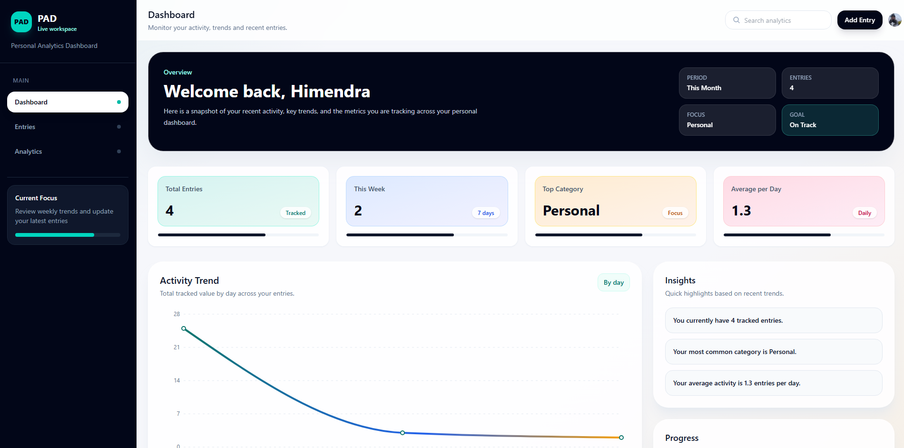
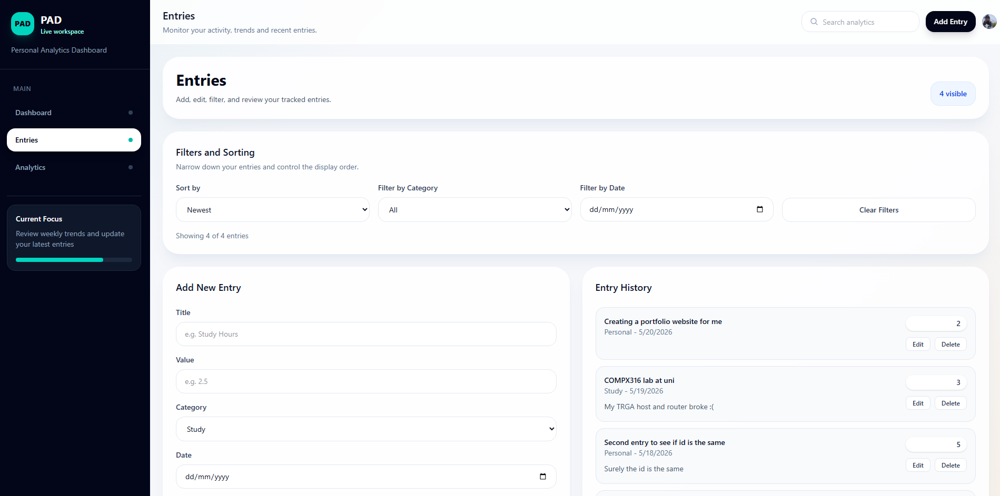
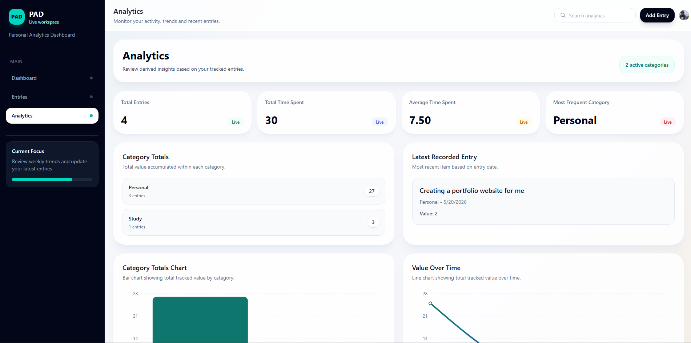
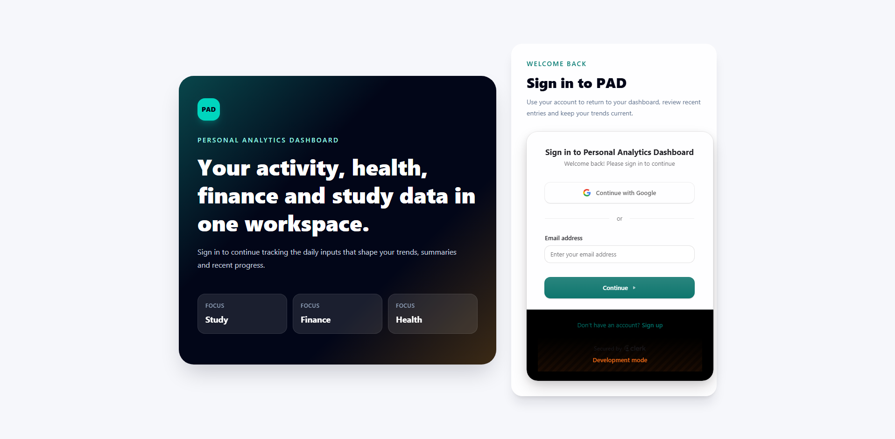
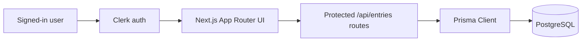

# Personal Analytics Dashboard

Authenticated personal metrics tracker for logging study, finance, health, and personal activity, then reviewing those entries through dashboard summaries, filtered history, and analytics charts.

**Live demo:** [personalanalyticsdashboard.vercel.app](https://personalanalyticsdashboard.vercel.app)

[](https://github.com/HimendraFdo/personal-analytics-dashboard/actions/workflows/ci.yml)

---

## Preview









---

## What the app does

- Protects dashboard, entries, analytics, and entry API routes with Clerk authentication
- Stores entries per signed-in user so each user only sees and manages their own data
- Supports creating, editing, deleting, sorting, and filtering tracked entries
- Tracks four categories: `Study`, `Finance`, `Health`, and `Personal`
- Shows dashboard summaries for total entries, weekly activity, top category, average entries per day, recent entries, and progress
- Shows analytics for category totals, latest entry, total tracked value, average value, and value over time

---

## Tech stack

| Layer | Tools |
|-------|-------|
| App | Next.js 15 App Router, React 19, TypeScript |
| Auth | Clerk |
| Styling | Tailwind CSS 4 |
| Data | Prisma ORM, PostgreSQL |
| Charts | Recharts |
| Validation | Zod |
| Testing | Vitest |
| Hosting | Vercel |
| Database (production) | [Neon](https://neon.tech) serverless Postgres |

---

## Architecture



Routes:

| Route | Purpose |
|-------|---------|
| `/` | Redirects to `/dashboard` |
| `/sign-in` | Clerk sign-in page |
| `/sign-up` | Clerk sign-up page |
| `/dashboard` | Overview, trend chart, recent entries, and progress summary |
| `/entries` | Entry form, edit/delete actions, filtering, sorting, and history |
| `/analytics` | Derived totals, latest entry, category chart, and value-over-time chart |
| `/api/entries` | Authenticated `GET` and `POST` handlers |
| `/api/entries/[id]` | Authenticated `PATCH` and `DELETE` handlers |

The API uses Clerk's `userId` to scope reads and writes. Prisma persists entries with `userId`, category, date, value, title, note, and timestamps.

---

## Quick start (local)

```bash
git clone https://github.com/HimendraFdo/personal-analytics-dashboard.git
cd personal-analytics-dashboard
npm install
```

Create `.env.local`:

```bash
DATABASE_URL="postgresql://..."
NEXT_PUBLIC_CLERK_PUBLISHABLE_KEY="pk_..."
CLERK_SECRET_KEY="sk_..."
NEXT_PUBLIC_CLERK_SIGN_IN_URL="/sign-in"
NEXT_PUBLIC_CLERK_SIGN_UP_URL="/sign-up"
NEXT_PUBLIC_CLERK_AFTER_SIGN_IN_URL="/dashboard"
NEXT_PUBLIC_CLERK_AFTER_SIGN_UP_URL="/dashboard"
```

Then prepare the database and start the app:

```bash
npx prisma migrate dev
npm run db:seed   # optional sample data
npm run dev
```

Open [http://localhost:3000/dashboard](http://localhost:3000/dashboard).

### Environment variables

| Variable | Required | Purpose |
|----------|----------|---------|
| `DATABASE_URL` | Yes | PostgreSQL connection string, usually Neon in production |
| `NEXT_PUBLIC_CLERK_PUBLISHABLE_KEY` | Yes | Public Clerk browser key |
| `CLERK_SECRET_KEY` | Yes | Server-side Clerk key used by protected routes |
| `NEXT_PUBLIC_CLERK_SIGN_IN_URL` | Recommended | Points Clerk to the local `/sign-in` route |
| `NEXT_PUBLIC_CLERK_SIGN_UP_URL` | Recommended | Points Clerk to the local `/sign-up` route |
| `NEXT_PUBLIC_CLERK_AFTER_SIGN_IN_URL` | Recommended | Sends users to `/dashboard` after sign in |
| `NEXT_PUBLIC_CLERK_AFTER_SIGN_UP_URL` | Recommended | Sends users to `/dashboard` after sign up |

---

## Scripts

| Command | Description |
|---------|-------------|
| `npm run dev` | Start the Next.js dev server |
| `npm run build` | Generate Prisma Client and create a production build |
| `npm run vercel-build` | Generate Prisma Client, deploy migrations, and build for Vercel |
| `npm run start` | Start the production server |
| `npm run lint` | Run the configured Next.js lint command |
| `npm run test` | Run Vitest tests |
| `npm run test:watch` | Run Vitest in watch mode |
| `npm run db:migrate` | Create and apply local Prisma migrations |
| `npm run db:seed` | Seed sample entries |
| `npm run db:push` | Push Prisma schema changes without creating a migration |

---

## Production deploy (Vercel + Neon + Clerk)

1. Create a [Neon](https://neon.tech) project and copy the pooled PostgreSQL connection string.
2. Create a Clerk application and copy the publishable and secret keys.
3. Import the repo in [Vercel](https://vercel.com).
4. Set `DATABASE_URL`, `NEXT_PUBLIC_CLERK_PUBLISHABLE_KEY`, `CLERK_SECRET_KEY`, and the Clerk route variables in Vercel Environment Variables.
5. Deploy. Vercel runs `npm run vercel-build`, which runs `prisma migrate deploy` before `next build`.
6. Visit `/sign-up`, create an account, add an entry, then confirm it appears on `/dashboard`, `/entries`, and `/analytics`.

See [MIGRATION.md](./MIGRATION.md) for API details and troubleshooting.

---

## Testing

The test suite covers date helpers, entry serialization, and validation logic.

```bash
npm run test
```

---

## What I learned

- Migrating a Vite-style dashboard into the Next.js App Router while keeping shared UI state predictable
- Adding Clerk authentication around app routes and API routes
- Scoping database records by authenticated `userId`
- Modeling entries with Prisma enums, migrations, indexes, and typed API responses
- Validating create and update payloads with Zod before database writes
- Centralising fetch and mutation logic so dashboard, entries, and analytics stay in sync
- Deploying Prisma migrations safely through the Vercel build flow

---

## Future work

- Export entries as CSV or JSON
- Add date-range controls to analytics charts
- Add goal configuration instead of fixed progress assumptions
- Add profile settings and user-facing account controls
- Add richer onboarding and empty states for first-time users

---

## Project structure

```text
app/             Next.js routes, layouts, auth pages, and API handlers
components/      Dashboard, entries, analytics, layout, and status UI
contexts/        Shared entries provider
hooks/           Client-side entry loading and mutation hooks
layouts/         Shell layout wrapper
lib/             Prisma client, API helpers, errors, validation, serialization
prisma/          Schema, migrations, and seed data
types/           Shared TypeScript entry types
utils/           Date formatting and parsing helpers
Images/          README screenshots
planning/        Planning notes and roadmap documents
```

Interview walkthrough: [DEMO_SCRIPT.md](./DEMO_SCRIPT.md)
